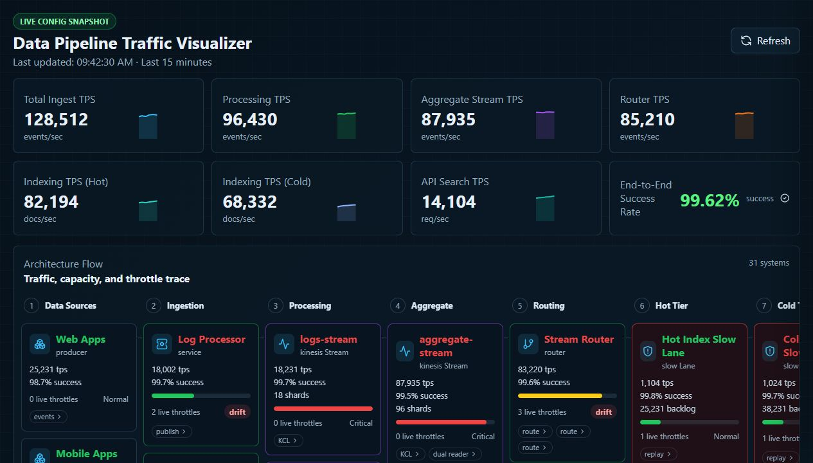
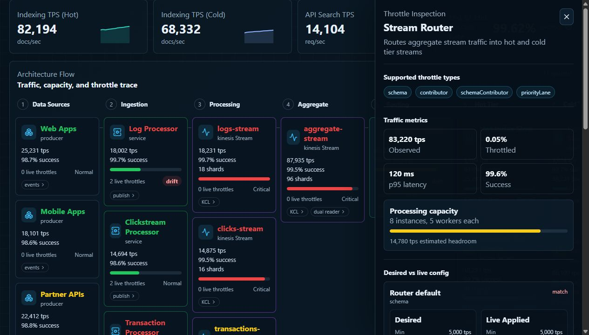
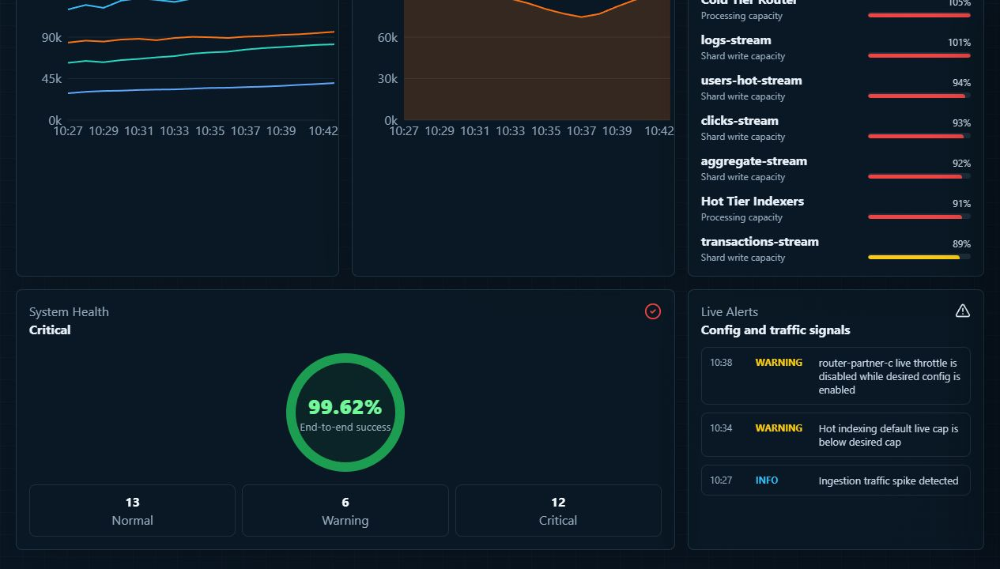

# data-pipeline-traffic-visualizer

Configurable operator dashboard for data-pipeline traffic, Kinesis capacity, and desired vs live throttle configuration.

## Run

```sh
npm install
npm run dev
```

The dashboard loads editable runtime snapshots from `public/config/`:

- `architecture.json` for systems, streams, slow lanes, clusters, APIs, and edges.
- `desired-throttles.json` for intended dynamic throttle config.
- `live-throttles.json` for the currently applied throttle snapshot.
- `traffic-snapshot.json` for static traffic metrics until live metrics are connected.

Use the dashboard `Refresh` button after changing the JSON files.

## Screenshots

Dashboard overview:



Throttle inspection drawer:



Lower traffic, health, and alert panels:



## Verify

```sh
npm test
npm run build
```
