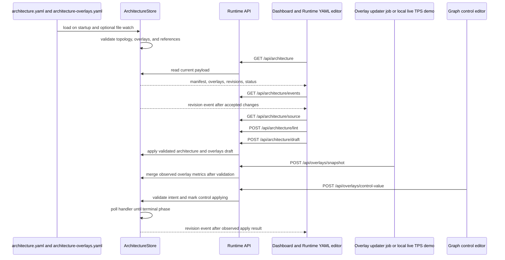

# data-pipeline-traffic-visualizer

Proof-of-concept topology dashboard for operating broad, multi-account service areas.

## What

This project explores a dashboard model where a team can define its own architecture graph and overlay live or near-live operational context on top of each service, route, queue, stream, cluster, or dependency.

The core idea is deliberately simple:

- `architecture.yaml` defines the relatively stable system map.
- `architecture-overlays.yaml` defines current scaling, traffic rates between systems, throttle configuration, deployment state, queue or stream health, shard counts, and other runtime context.
- The runtime dashboard renders both as a single view so teams can see each moving part in relation to the rest of the service.

## Why

Large service areas create operator cognitive overhead. This project reduces that overhead by mapping topology and relevant configuration into a visual model: account boundaries, services, streams, processors, routes, throttles, deployment state, recent changes, and where each fact sits in the broader service.

CloudWatch and Grafana already solve broad observability problems. CloudWatch supports cross-account observability for AWS telemetry, dashboards can span accounts and Regions, Grafana can visualize metrics, logs, traces, and other data from many backends, and CloudWatch investigations can scan telemetry to surface related metrics, logs, deployment events, and root-cause hypotheses.

This project is complementary: it focuses on team-specific architecture topology and dependency knowledge across accounts, repositories, deployment systems, queues, streams, services, and operational conventions. The goal is to move that map out of senior engineers' heads, keep it explicit, and make the system easier to inspect, update, and reason about during operations.

## Philosophy

- Model the architecture first; telemetry should decorate the map, not define it.
- Keep topology and volatile metrics separate so slow-moving structure stays reviewable.
- Prefer an accurate cross-system view over a perfect integration with any single vendor.
- Make the dashboard easy to update from jobs, scripts, or account-specific collectors.
- Preserve enough context that an engineer can understand what changed and where it sits in the larger service area.

## Runtime Architecture

At a high level, this is a YAML-backed dashboard with a light runtime API. The architecture and overlays start from disk, the browser reads a validated runtime payload, the editor can lint and apply a draft, and update jobs can push fresh overlay snapshots without changing the topology.



## Local Live TPS Demo

Run the local API-backed demo with:

```bash
npm run demo:live
```

The command starts the Vite dev server, opens the existing runtime API middleware, and posts a complete sample overlay snapshot to `POST /api/overlays/snapshot` every 2 seconds. The dashboard receives the existing SSE revision event, refetches `GET /api/architecture`, and updates stream TPS chips and edge labels without a separate dashboard data channel.

The live values are generated sample telemetry from the committed architecture; they are intended to demonstrate how a real collector would push full overlay snapshots.

## GitHub Pages Demo

The GitHub Pages demo is a static build from the sample YAML in `data/sample/`. It does not expose the runtime API or the local live TPS updater, but the Runtime YAML editor works in the browser and saves valid drafts to local storage.

To publish it, enable GitHub Pages in the repository settings with **Source: GitHub Actions** and custom domain `traffic-demo.u64.cam`, then run the `Deploy Pages Demo` workflow or push to `main`. The workflow runs `npm ci`, `npm test`, and `npm run build` with `VITE_STATIC_DEMO=1` and `VITE_BASE_PATH=/`, then deploys `dist/`.

Use the Pages deployment URL from the workflow summary as the team demo link.

## Sample Workflow

The screenshots below are generated from the committed sample files in `data/sample/` by `npm run screenshot:architecture`.


The runtime editor opens the same architecture and overlay model that is currently rendered, so local edits can be linted and applied against the live dashboard.


## Manifest Contract

The topology source of truth is `architecture.yaml`. The default representative sample lives at `data/sample/architecture.yaml`; deployments can point `ARCHITECTURE_DATA_DIR` at another non-public directory containing `architecture.yaml` and `architecture-overlays.yaml`.

Every node requires:

- `id`: stable node identifier used by views and future overlays.
- `label`: display name.
- `type`: display classification such as `app`, `stream`, `router`, `indexer`, `cluster`, `api`, `queue`, `processor`, or `group`.
- `region`: region code such as `use1`.
- `zone`: topology lane such as `pre_aggregate`, `aggregate`, `hot`, `cold`, or `partner`.
- `parent`: optional parent group node ID.

Every edge requires:

- `id`: stable edge identifier used by focus views and future overlays.
- `from`: source node ID.
- `to`: target node ID.
- `type`: edge classification such as `publish`, `feed`, `route`, `consume`, `index`, `serve`, `sideline`, `drain`, or `replay`.
- `label`: optional display text.

Views are explicit. The default sample view is a broad end-to-end path: it keeps the USE1 local workflow visible while staging summary destination streams for USW2 and EUW1 so cross-region publish behavior is visible without switching views. Per-region views retain deeper destination-region detail. The model also supports destination-region cross-region views and focus views with `focus_edges`, `primary_edges`, and `secondary_edges` lists of edge IDs, but those should be used sparingly for targeted investigations rather than as default navigation.

Region views can also define presentation metadata:

- `lanes`: named horizontal bands such as `cold`, `normal`, `hot`, `slow_lane`, and `partner`.
- `stages`: ordered left-to-right columns. Each stage has `id`, `label`, `lane`, and `node_ids`.

Stage `node_ids` must reference existing nodes. Layout metadata does not create topology and must not introduce synthetic nodes or edges.

## Overlay Contract

Decorators live in `architecture-overlays.yaml`. The default representative sample lives at `data/sample/architecture-overlays.yaml`. Overlays add real-world metrics and config to the rendered diagram without changing topology.

Overlay files can define:

- `node_decorators`: reference `node_id` and render compact node chips such as shard count, retention, OpenSearch node count, and instance type.
- `edge_decorators`: reference `edge_id` and render edge badges, warning state, metric labels, tone, or thickness.
- `route_decorators`: reference a `source_node_id` plus an ordered `edge_ids` path. Route decorators apply only to those explicit edges, which is the intended way to show source-app throttle/schema config downstream.
- `controls`: reference a node, edge, or route decorator and expose editable operator intent such as a per-token throttle. A control separates `spec` edit constraints from mutable `state`, so a throttle value is not confused with its min, max, step, unit, or priority policy.

Example:

```yaml
node_decorators:
  - id: orders-stream-capacity
    node_id: use1.ingestion.orders_stream
    title: Orders stream
    metrics:
      - label: shards
        value: 12
      - label: retention
        value: 24h

edge_decorators:
  - id: partner-feed-throttle
    edge_id: edge.use1.sources.partner.to.partner.ingestion
    title: Partner feed throttle
    badges:
      - throttle 500/s
      - schema partner-v3
    warning: true

route_decorators:
  - id: partner-source-downstream-throttle
    source_node_id: use1.sources.partner_webhook
    title: Partner webhook throttle path
    badges:
      - throttle 500/s
      - schema partner-v3
    edge_ids:
      - edge.use1.sources.partner.to.partner.ingestion
      - edge.use1.partner.ingestion.to.partner.processor
      - edge.use1.partner.processor.to.aggregate

controls:
  - id: partner-token-aggregate-throttle
    target:
      kind: route
      id: partner-source-downstream-throttle
    dimensions:
      token: partner-v3
    label: Partner route throttle
    apply:
      handler: simulated-throttle-config
    spec:
      value_type: number
      min: 0
      max: 2000
      step: 50
      unit: /s
      priority:
        editable: true
        min: 0
        max: 100
        step: 1
    state:
      desired_value: 500
      effective_value: 500
      priority: 20
      apply:
        phase: idle
```

## Topology Invariants

- `architecture.yaml` must not contain metrics, overlay values, AWS discovery output, CDK data, shard counts, replica counts, capacity settings, route keys, fanout semantics, or message metadata.
- Overlays must live in separate files and reference stable node IDs or edge IDs.
- Route overlays are explicit ordered paths; downstream throttle/schema decoration is not inferred by graph traversal.
- `crossRegion` is derived by comparing the direct source and target node regions.
- Rendered visual edges are one-to-one with manifest edges; grouping metadata does not hide nodes or roll up edges.

## Adding Topology

1. Add the node with a stable `id`, required display fields, and optional `parent`.
2. Add edges with stable IDs. Do not reuse or rename edge IDs once overlays depend on them.
3. Add node IDs to regional view `stages` when they should appear in the whiteboard-style sequential flow.
4. Add cross-region or focus views only when a route needs a dedicated investigation surface.
5. Keep partner topology in the `partner` zone. The v0 model intentionally excludes partner entry streams, partner route streams, partner router apps, route keys, fanout semantics, message metadata, shard/replica/capacity config, AWS discovery, CDK parsing, overlays, and live metrics.

## Runtime API

The browser loads parsed architecture data from `GET /api/architecture`; raw YAML files are not exposed from `public/`.

- `GET /api/architecture`: returns `manifest`, current `overlays`, revisions, source, generated time, and status.
- `GET /api/architecture/events`: emits revision events with server-sent events so connected browsers refetch after runtime changes.
- `POST /api/overlays/snapshot`: runtime update job input for observed overlay metrics. Snapshot `mode` defaults to `merge`; use `control` only for authoritative control-backend observations.
- `POST /api/overlays/control-value`: starts one editable control apply operation. The server validates intent, marks the control `applying`, emits an overlay revision, polls the configured handler, and updates `effective_value` only after the simulated generated config is observed.

Overlay updaters should post `ArchitectureOverlays` snapshots every N minutes, or more frequently for local/demo use. Invalid snapshots are rejected and the previous active overlay remains visible. `npm run demo:live` is the sample implementation: it posts generated stream TPS overlays with `source: "sample-live-tps"` every 2 seconds.

Control edits are operator-owned runtime intent, not telemetry. The first control-plane stub stores operation state in memory, so edits survive refetches and SSE updates but reset on server restart. Controls are gated with split flags:

- `GRAPH_CONTROLS_VISIBLE=1`: show control cards and control-plane status in the dashboard.
- `GRAPH_CONTROL_APPLY_ENABLED=1`: allow `POST /api/overlays/control-value` to call the configured handler.
- `GRAPH_CONTROLS_PREVIEW=1`: compatibility alias for visible-only mode. Apply remains disabled unless `GRAPH_CONTROL_APPLY_ENABLED=1` is also set.

A control edit request looks like:

```json
{
  "controlId": "partner-token-aggregate-throttle",
  "desiredValue": 750,
  "priority": 30,
  "source": "graph-control"
}
```

The server validates the control ID, target reference, explicit handler, value type, numeric bounds, step alignment, and whether priority is editable before starting an apply operation. The included `simulated-throttle-config` handler returns an operation ID immediately. The store polls until the handler reports a terminal phase or the poll budget expires, and `effective_value` updates only after observation.

See [Control Plane Extension Plan](docs/control-plane-extension.md) for how this model maps to a real SQS/S3 apply-and-poll control plane.
